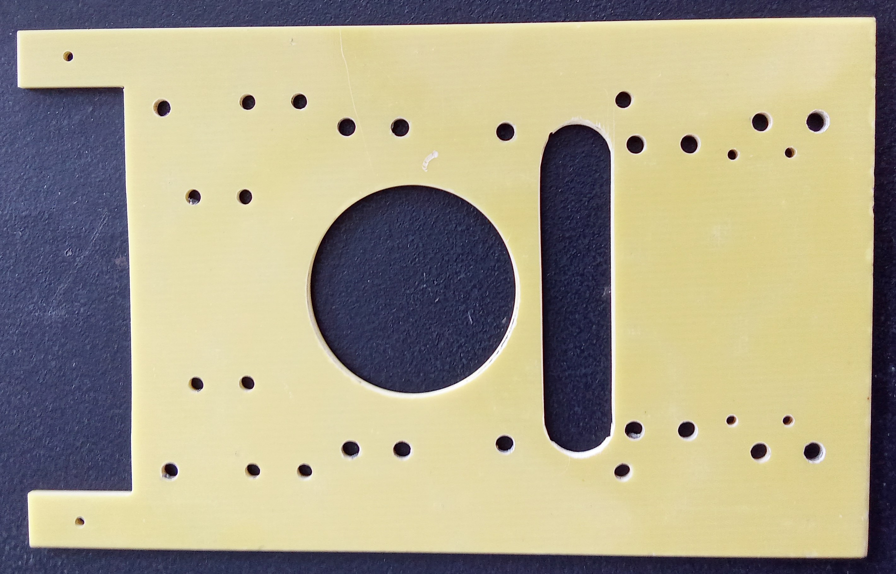

<pre>
This is the device mounting board for the CPU09 system. 
It can hold HD, FC, SD.
</pre>

<pre>
It can hold 2 device, one on each side in a 19" rack.

Or a mix, HD and SF, HD and SD, FC and SD.
For the 44/40 pin IDE devices as used in "DISK_TYPES".

Support:
        2.5" HDD
        2.5" HDD Adapter
        GC100 44/40 adapter
        SD35VC0 + SD card
        TF35VA0 + SD card
        ST307   + FC card
        CF-IDE40.V.E0 + FC card
        CF-IDE44.V.H0 + FC card

</pre>

