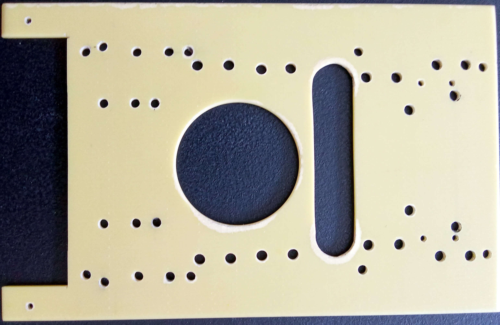

<pre>
This is the device mounting board for the CPU09 system. 
It can hold HD, SSD, FC, SD.
</pre>

<pre>
It can hold 2 device, one on each side in a 19" rack.

Or a mix, HD and SF, HD and SD, FC and SD.
For the 44/40 pin IDE/SATA devices as used in "DISK_TYPES".

Support:
        2.5" HDD, IDE & SATA
        2.5" SSD, IDE & SATA
        2.5" HDD Adapter
        GC100 44/40 adapter
        SD35VC0, SD to IDE
        TF35VA0, SD to IDE
        ST307, FC to IDE
        CF-IDE40.V.E0, FC to IDE
        CF-IDE44.V.H0, FC to IDE
        MCA004 (A 90grd), SATA to IDE
        MCA004 (B), SATA to IDE
        SDSATAVH0, SD to SATA
        Kebidu, CF to SATA

The mounting PDFs show 3 board versions,
but the texts describe board V2.0 for IDE
and board V3.0 for IDE and SATA.

Mounting, shows all IDE devices on one of the sides.
Mounting 2, shows examples with the same IDE device on both sides.
Mounting Mix, shows examples with a different IDE device on each side.
Mounting Sata, shows examples with SATA devices.

Mounting 3.5" drive, not need this board.

Due to the many images in the PDFs, they are compressed.
If there is no text in the PDF's use "Dowload raw file".

</pre>

