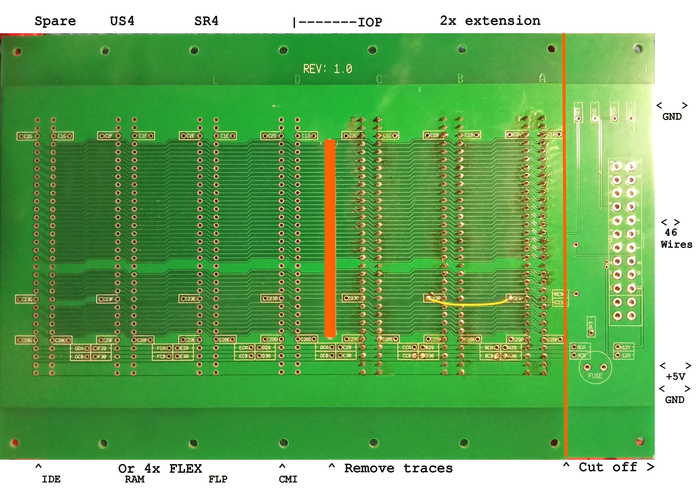

This is the extender backplane for the CPU09 system. It has space for 3 + 4 slots.

It uses 2 pcs version 1.0 BP7.
But you can also use the version 1.2 BP7.

It gives 10 slots for UniFLEX and 3 slots for the CPU09IOP 
or 4 slots for FLEX in the same 19" frame.

The backplane wiring is flexible.
There are two locations for SR4 and/or US4 cards.
The GPP cards do not use external card selection 
and can therefore be placed anywhere, even in locations that do have selection, 
such as the IDE1 SR4 US4 and IOP.

The last section of the extension backplane is wired for either the IOP 
with two locations for SR4 and/or US4 or for a set of four FLEX cards.

