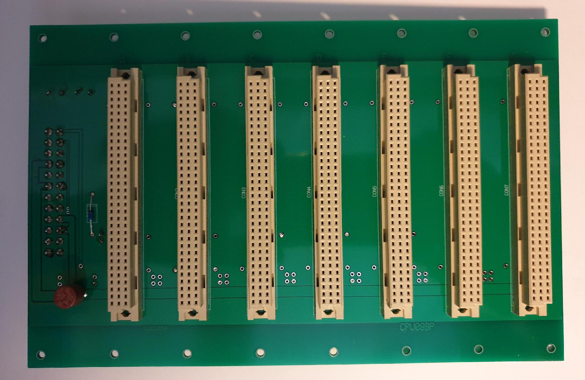

This is the backplane for the CPU09 system. It has space for 7 slots.

It has a ATX style power connector. Remote reset button, local fuse as the boards (CPU/MON/IDE) use about 0.8A max.
An ATX power supply can deliver enough current in the 5 Volt to create fireworks on errors.

2019-10-22
WARNING: The first version of the backplane has an error, (CPU09BP_190920). The connector sits at the other side from the silk image!!!!!

2019-10-22:
Revision 1.1 of the backplane has the power connector corrected (CPU09BP_20191022). The old version is deleted.

2019-11-06:
Revision 1.2. Disturbing silk error  corrected, holes for power connector upped to 1.5mm. Copper was/is correct. 
