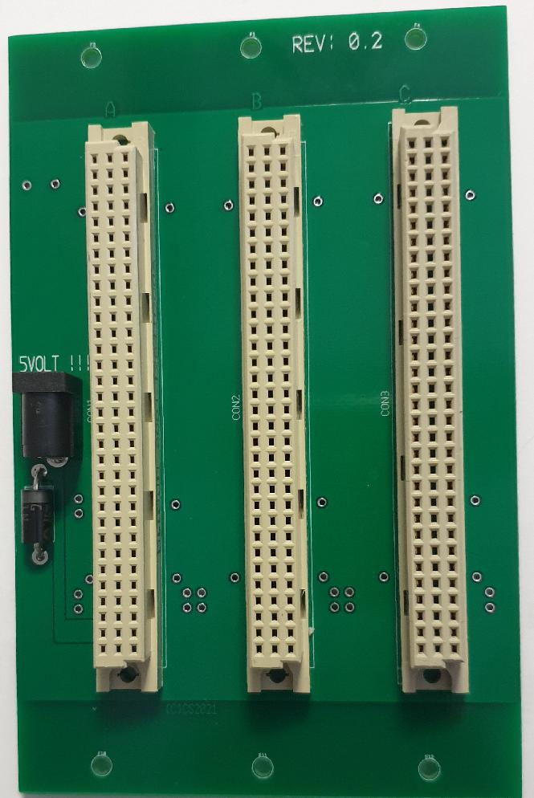

Sometimes you need only a small backplane for a compact(tiny) system

This one has 3 slots and a 5mm/2.1mm power connector 5 VDC. I added provision for a 1N5908
TRANSIL diode. It can save your day when inadvertently a wrong type of voltage is applied.

2021-01-20
First release.
