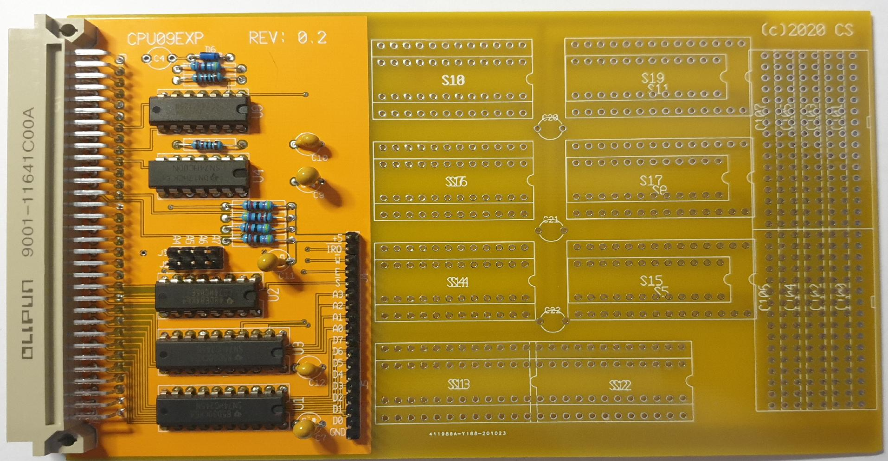

The is the CPU09EXP-baord

It came to me a few times that I needed a board to try some
circuits on. So I sat down and here it is. The objective was
to keep it as simple as possible, hence no GAL logic here.

* All signals are fully buffered. 
* Address decoding in 16 byte regions
* no GAL's
* extensive breadboard area.

 
