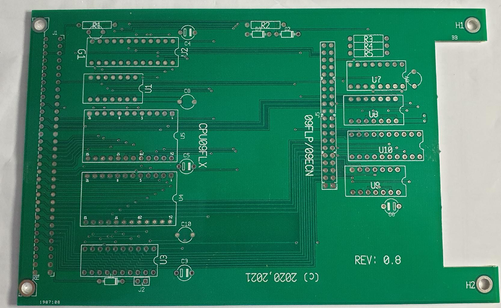

Here is the CPU09FLX board

Provides:
* address decoding for FEXXX / XEXXX
* 2K RAM socket
* 2K (EP)ROM socket
* 40 pole connector with CPU09GPP layout
* flexible IO decoding due to GAL

This board allows a very compact FLEX system to be build. With the CPUXXCMI you
would have: 2K Monitor ROM, 68X02/68X09/63X09 CPU, 64K RAM, Console ACIA, baud 
clock generator fully buffered bus signals.

The mini-backplane CPU09BP3 would be more then plenty for such a system.

Rev: 0.4,  the very first version of the board

Rev: 0.8,  a version with circuitry for an interval timer added and cut-out area
           for connectors

For a FLEX (r) application any revision can be used. The databus driver is the
only IC present. On the IO connector one can place:

09FLP, the max clock frequency of the CPU determines the max. floppy data rate.

09ECN, the max clock frequency again determines the maximum data rate possible.

