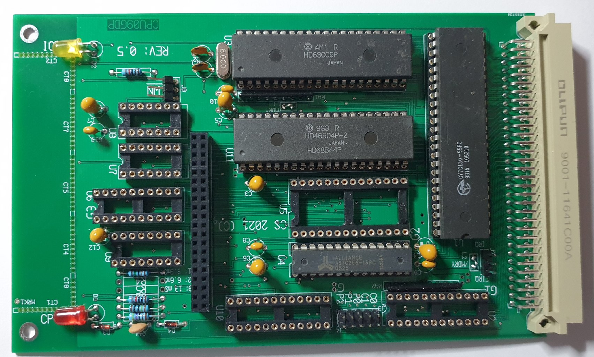

This is the CPU09GPD, it has the characteristics of the CPU09GPP, but
it has a 68B44 DMA controller next to the CPU.

2022-07-31:

As the 68B44 limits the E clock to 2 MHz max, the CPU runs also at 
that speed.

The CPU09GPD would allow 'fast' peripherals to be used. The IO-bus
definition has been adapted for this purpose.

The board has been made and even populated, what remains is testing it.

 
