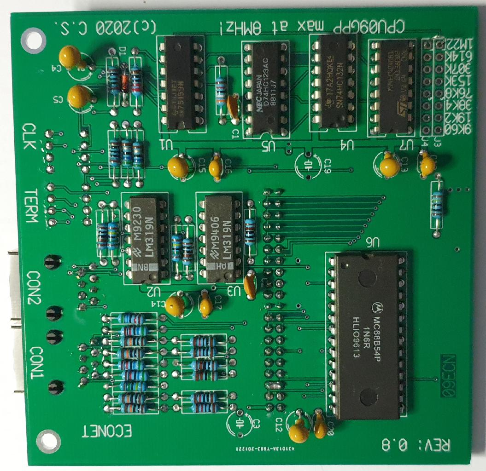

The 09ECN pop-up board. 'Econet' capable interface.

Introduction:

My eye catched the Econet interface that was popular some years ago with the BBC 
computer. The hardware revolves around the MC68B54. I found it interesting
enough to create a pop-up for the CPU09GPP (_and_ CPU09FLX) board.

I have not yet made up my mind how the network is to be implemented. Options are
exclusive for UniFLEX, but I can envision diskless FLEX system too. 

It will be fun to play with those during the long winter eveneings

I have ordered a couple of prototype boards already. One area where we need to
give in is, CPU speed of the CPU09GPP, with the 09ECN board the max. Xtal will
be around 10 MHz as there are no faster MC68B54 around.

But that is still very fast :-). 

To be continued....... 

Provides

* MC68B54 ADLC controller
* wide biterate selection, 1.228MHz...9K6
* dual connectors CAT8
* dipswitches for line termination disable/enable
* dipswitches for clock source disable/enable
* collision detection
* hardware Econet (R) compatible
* CPU09GPP IO comaptible (max GPP bus frequency 8...10MHz)
* CPU09FLX IO compatible 

This interface is suitable for simple network applications. The ADLC
is capable to transfer a data packet with minimal code/overhead and maximum
flexibility. 

In the future the board may get a change such that it can work with the CPU09GPD,
where the data transfer between 68B54 and memory is under DMA. Anyway the
board will remain backwards compatible with the CPU09GPP board.

