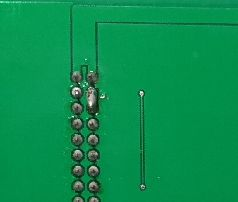

Here is the hidden 09FLP SEL2- bug

See this modification:

<pre>
The 09FLP board Rev 0.3 and Rev 0.9 have the SEL2- signal on J1 pin-36.
The 09FLP board Rev 1.0 has the SEL2- signal on J1 pin-38.

The CPU09FLX Rev 0.8 has the SEL-2 signal on J1 pin-38
The CPU09FLX Rev 0.4 has the SEL-2 signal on J1 pin-36

The CPU09GPP Rev 0.2, Rev 1.0 has the SEL-2 signal on J1 pin-38

So depending on the revision number combination 
the SEL2- signal may or may not be connected.

With the solder bridge shown on J1 between pin 36 and pin 38, 
all cards are interchangeable.

Because the 09NET boards use J1 pin-36 for DRQ1 
make the solder bridge on the 09FLP Rev 0.3 / Rev 0.9 card.

</pre>
