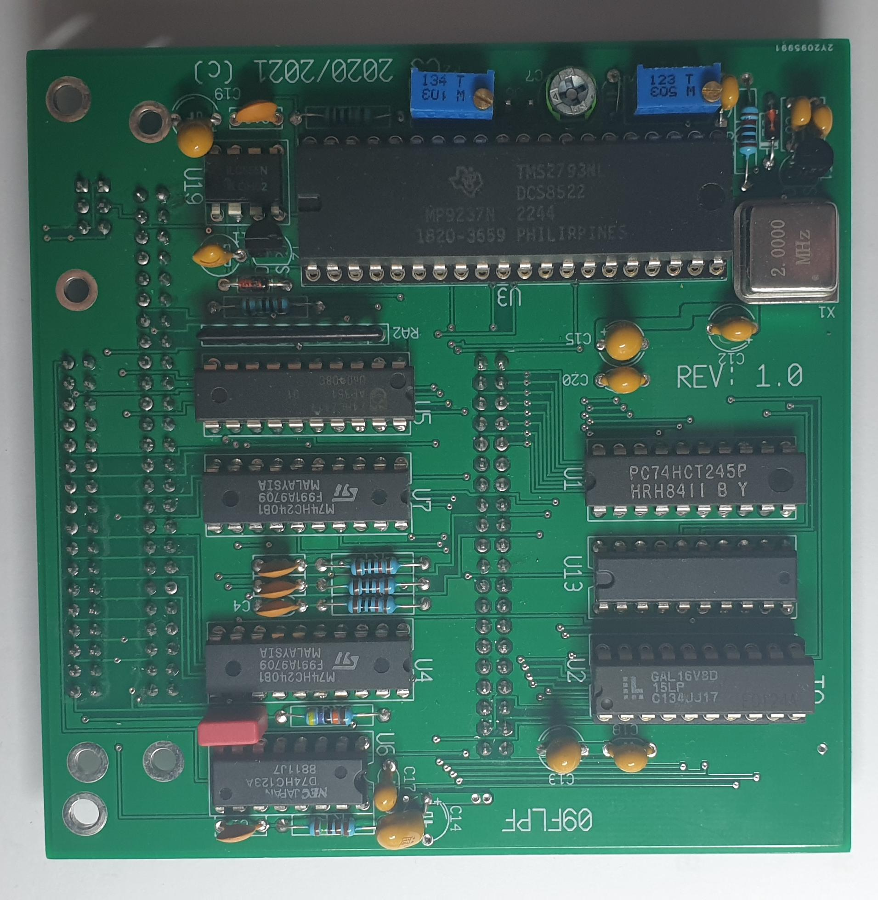

This is the 09FLP pop-up board

<pre>
With this board, my UniFLEX driver can handle a multitude of floppy-disk formats.

2022-03-24: The driver as is of now can do all again  :-)

FD-SS,  8", 77 track, 8 sectors,  single dens, single side (250kBit)
FD-DS,  8", 77 track, 8 sectors,  single dens, double side
FD-SD,  8", 77 track, 16 sectors, double dens, single side (500kBit)
FD-DD,  8", 77 track, 16 sectors, double dens, double side

F8-SS80,  3|5", 80 track, 8 sectors,  single dens,  single side (250kB)
F8-DS80,  3|5", 80 track, 8 sectors,  single dens,  double side 
F8-SD80,  3|5", 80 track, 16 sectors, double dens,  single side (500kBit)
F8-DD80,  3|5", 80 track, 16 sectors, double dens,  double side
F5-SS80,  3|5", 80 track, 5 sectors,  single dens,  single side (125kBit)
F5-DS80,  3|5", 80 track, 5 sectors,  single dens,  double side 
F5-SD80,  3|5", 80 track, 9 sectors,  double dens,  single side (250kBit)
F5-DD80,  3|5", 80 track, 9 sectors,  double dens,  double side

F5-SS40,  5", 40 track, 5 sectors,  single dens,  single side (125kBit)
F5-DS40,  5", 40 track, 5 sectors,  single dens,  double side
F5-SD40,  5", 40 track, 9 sectors,  double dens,  single side (250kBit)
F5-DD40,  5", 40 track, 9 sectors,  double dens,  double side

F5-SS40=, 5", 40 track, 5 sectors,  single dens,  single side (125kBit)(double step, 40 track disk in 80 track drive)
F5-DS40=, 5", 40 track, 5 sectors,  single dens,  double side
F5-SD40=, 5", 40 track, 9 sectors,  double dens,  single side (250kBit)(double step, 40 track disk in 80 track drive)
F5-DD40=, 5", 40 track, 9 sectors,  double dens,  double side

F5-SD80E, 3|5", 80 track, 10 sectors, double density, single side (250kBit)
F5-DD80E, 3|5", 80 track, 10 sectors, double density, double side

F3-SD80,  3", 80 track, 18 sectors, double density, single side (500kBit)
F3-DD80,  3", 80 track, 18 sectors, double density, double side
F3-SH80,  3", 80 track, 20 sectors, double density, single side
F3-DH80,  3", 80 track, 20 sectors, double density, double side
</pre>

But the UniFLEX driver/GPP/09FLP combo can handle other sector formats as well.

For FLEX it uses the 256 byte sectors without difficulty.

