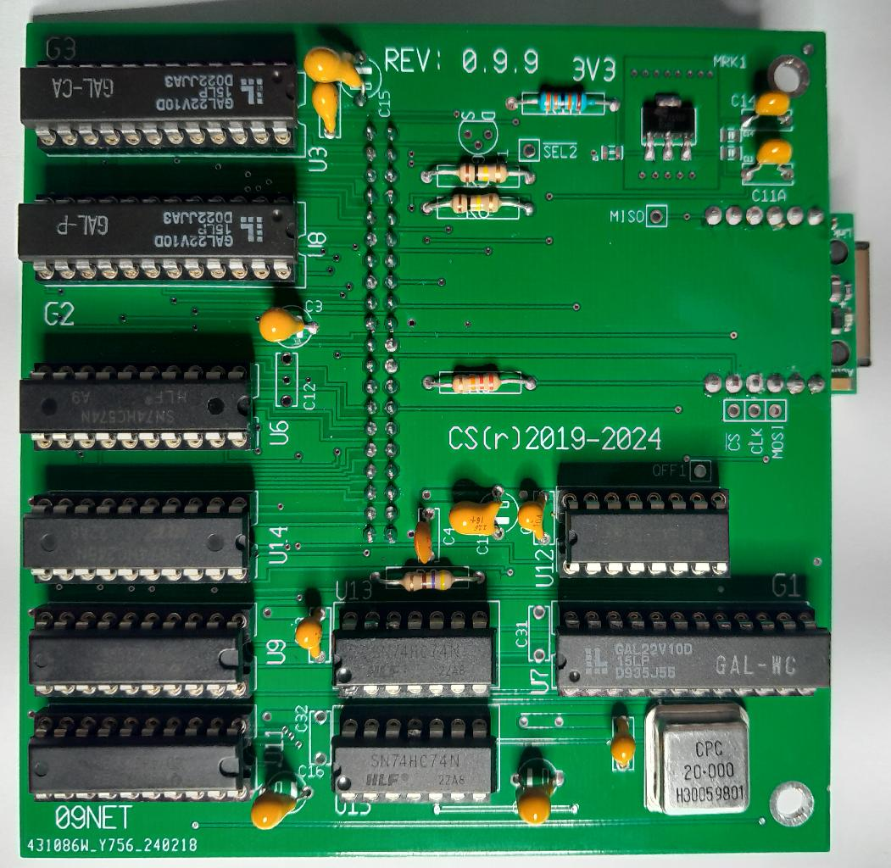

 This is the new 09NET module (but NOT THE LATEST V1.0 version!)
 
 
 
* works with CPU09GPP 
* works with UniFLEX kernel with 'sockets' added to kernel  ../NET/..
* wzdrvr/wzdev/socket should be in kernel boot image  ../NET/..

The module in combination with the CPU09GPP provides TCP/IP communications
for UniFLEX 6X09. The software however is tailored for the HD63C09 CPU.

The module provides up to 8 socket connections.

The network connection is UTP connector.

In the kernel a few Berkely (TCP/IP) calls are added:

socket(), connect(), bind() and listen(), accept(), read(), write(), close,
recvfrom(), sendto().
so that both client and server applications can be served.

Additionally recfrom() and sendto() calls (UDP) are also implemented

Also a socklib.r is being created, that allows the Mc Cosh C compiler to
build programs with networking capabilities.

2024-02-28:
(*) The photo is NOT from the very latest board, but one will notice the extra
IC (U1) that can provide extra delays for SPI_CLK en SHCLK. 

New GALS patterns for the networking board. (G1, G2, G3)
Holes for W5500 and 20MHz oscillator are enlarged.

Artwork and component positions completely re-done and fix incorporated.

Board revision is 1.0. 

As 20MHz means 25/25nS which nears the propagation delays in some components.
While some combinations of brands of components provide a working board, we
found that some combinations did not work first try. The main reason was
that the SPI clock was not properly aligned with the data. Making it possible
to delay the SPI clk by some 10nS proved the solution for this.

