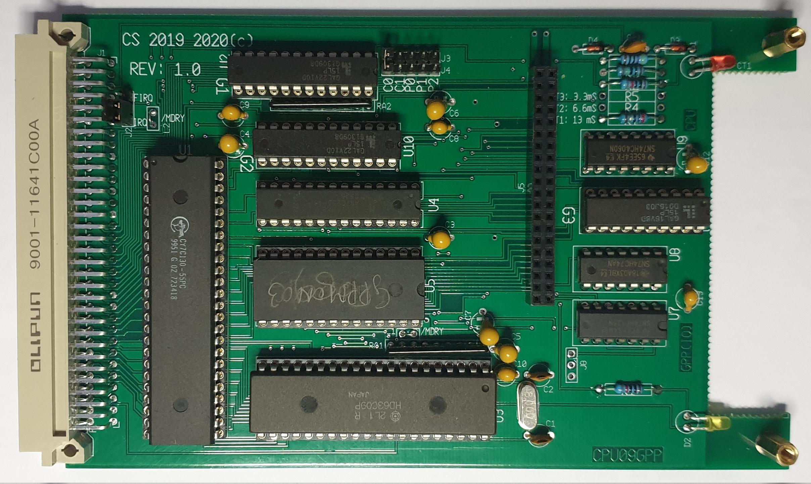

This is the CPU09GPP board, a dedicated IO processor 

See Description for the full details.

This board supports multiple interfaces like:
* floppy controller
* Econet interface
* SPI to W5500 network module
* What you can come up with......

