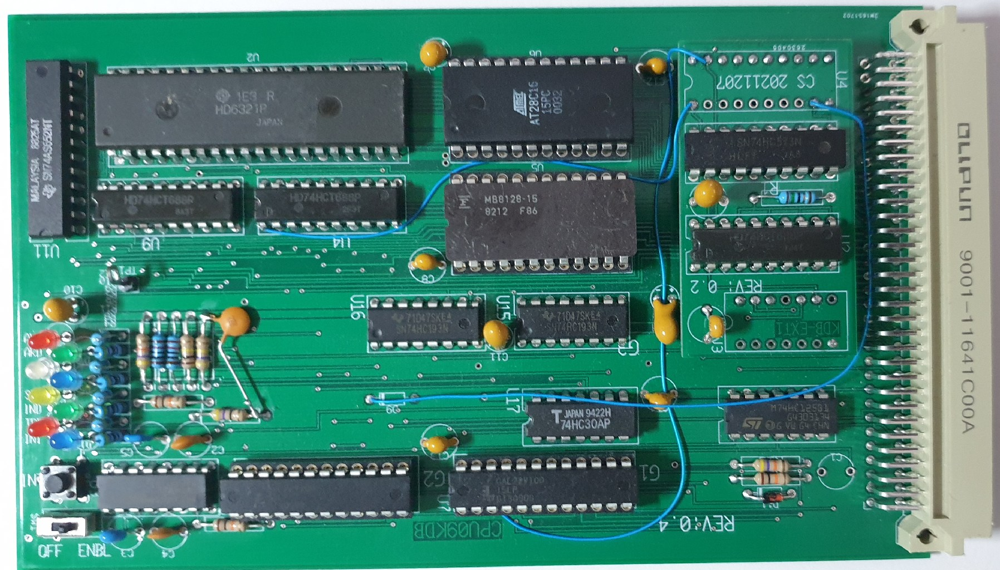

The CPU9KDB  2022-07-17

The CPU09KDB is a board that allows one to debug UniFLEX kernel code real-time.
The hardware accomodates a 20 bit address comparator. 16 Bits of the address 
are set in a PIA and the remaining 4 bits in an extra latch.
The PIA also controls and registers the various events. An NMI will be given
on any event.

The photo's are of the prototype version, that works very nice already. During 
the testing phase I discovered that I really had to check 20 bits virtual address.
That implied for 2 extra IC's. I can't place them on the board without starting anew.

As the user audience is not wide, I opted for an add-on board. On the prototype
board it rests on the pins of the underlaying IC's. The final version rests it on
three 9 pin headers, that accomodate all the connections. Almost same position.

The final design will also have an addition: RD/WR/ALL cycles capture for the
address trap.

As the upper addresses are hard-decoded, the board resides in the FEXXX page,
therefore none of the GPP boards can be used together with the CPU09KDB.

Address FE000-FE03F is IO of the board, FE040-FE7FF is RAM, FE800-FEFFF is ROM.

The software provides some basic functions:

A set address trap address, this is an absolute address in the kernel address range
    if set above B000, the trap is disabled

B activate the addresstrap, it automatically resets when the trap was taken.

C continue, exit debugger

M address, memory examine and change

P print memory range, new start and end address can be entrered by first giving the
    space character and then a new value

R print CPU registers

S single step, S+return is single step. S+byte value steps given amount of steps
    with a register dump after each step

The CPU09KDB is properly initialized when present at /reset time with the switch
at enabled.  When the kernel is running, pressing the push button will bring you
in the debugger.

It is a powerful but very dangerous piece of tool.

With the ROM absent and the board in place, it can be used to boot uniflex8, which
is the pathogical memory test from SWTPC. This version aims for a VT52 terminal (emulation).

