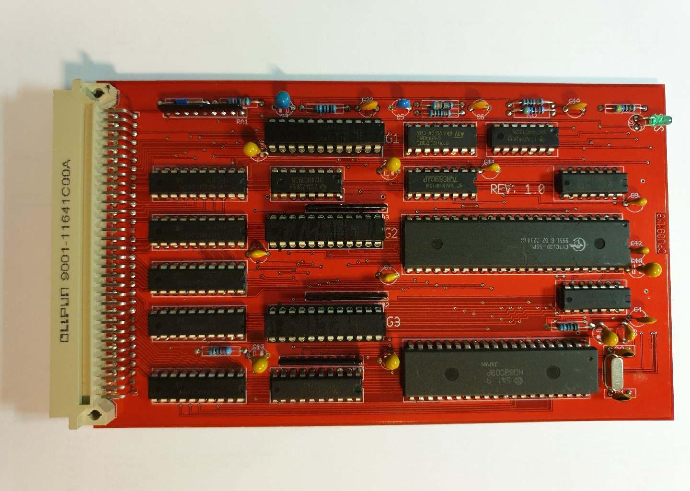

This file aims to describe the operation of the CPU09MM3 board and the various
parts of the circuit.

The CPU board has a couple of distinct functions:

* HD63C09 CPU
* CY7C130 DATBOX
* 74HC193 + 74HC74 System/User state counter, fuse register
* 74HC132 Reset circuit (U7C/U7D) and systemstate (U7A/U7B)
* 74HC590 + U19 Stack depth counter
* 74HC123 Interrupt watchdog
* 74HC574 Taskmap select latch
* GALS U10/U12/U14
* Buffers

GAL logic ensures that ANY access above $FE00 in the CPU address
range is disabled by inhibiting VMA. 
How do we get started in the first place? As the vectors are at $FFE0-$FFEF/$FFF0-$FFFF. 

While pressing the reset button, the 74HC193 counter is reset at 0, after
releasing the reset button the CPU will attempt to fetch the RESET vector.

While doing that, the bus status signal reflects IACK. During IACK the bus-signal
XFEXX is forced low. That enables the ROM on the CPU09MON board, so that the 
vector can be fetched. At the end of IACK, the 74HC193 counter is incremented
by one. When the 74HC193 counter is at state 0...14 the cpu board is in
system state. This holds XFEXX low for any access in the $FE00-$FFFF area.
The reset vector points to code in this $FE00-$FFFF area. The system
state also provide access to the 74HC590 counter, the taskmap select match,
the k_u_map (kernel/user map) select and the downcount of the 74HC193.

The first thing the code in UniBUG does is, decrementing the 74HC193 counter
by one, un-doing the reset vector fetch. Next it resets U18A, which disables
the taskmap select latch U17 and because of the RA2 pull-down, map 0 is active.
When U18A is reset it also enables access to the DATBOX. So now UniBUG code loads
the DATBOX locations for task 0 with $FE/$FF so that the task 0 map now has 
full access the the $E000-$FFFF addresses. It can now jump to the init code
in UniBUG.

$fe00     read_only,   stack depth counter
$fe01     write_only,  decrement 74HC193, fuse register
$fe02     write_only,  bit 7: 1 is user map (enables task select latch output), 
                       bit 7: 0 is kernel map (disables the task select output), 
                       a pull-down array  ensures that in this case task zero (0) 
                       is always active.
$fe03     write_only,  user-task memory-map select latch,
$fe04-$fe0f            non memory

$f400-$f7ff            DATBOX. holds 64 x 16 memory pages, each representing a 4 KByte
                       memory area.

+++++++++++++++++++++++++++++++++++++++++++++++++++++++++++++++++++++++++++++++

The things that the UniBUG code does is, checking the size of the system RAM, 
setting up RAM at $0000-$0FFF and $B000-$BFFF. The kernel stack resides below
$BF38. UniBUG sets up further tables that the OS will use later.

Further duties are setting up the DATBOX with the initial values and initializing
the console ACIA on the CPU09MON board.

When booting the OS, the first thing UniBUG does is, setting up RAM on
$5000-$9FFF and it checks that the system timer is operational.

The code in the bootsector assigns an additional $A000-$AFFF RAM area.

-------------------------------------------------------------------------------

When the OS is started the Init code sets up all further tables and area's,
hardware and enables the Interrupts.

Lastly it spawns task 1, which on starting, does a extra decrement of the
74HC193 counter to position 15 (all ones). This reflects the user state of
the system.

-------------------------------------------------------------------------------

Each process has the possibility to run in 65024 bytes maximum. At the top
of this address space is the process stack area and it's starting arguments.
The un-accessible memory at FE00-FFFF holds in fact all per-process data for
the system.

+++++++++++++++++++++++++++++++++++++++++++++++++++++++++++++++++++++++++++++++

On ANY interrupt, whether it is a hardware interrupt or a software
interrupt, the CPU fetches the interrupt vector. 

In 'user' state, a different interrupt vector array is selected 
$ffe0-$ffef
and in 'kernel' state the vectors from 
$fff0-$ffff

Like with the reset vector IACK is asserted, which gives access to the high ROM 
on the CPU09MON board and at the end of IACK, the 74HC193 is incremented from 
15 to 0. The systemstate is now active, so that the code in high ROM can be 
executed. The function of that code is switching back to the kernel map, 
saving all user-process parameters and stack, setting the kernel stack, 
running the interrupt handler.
Om return it restores the saved user stack pointer, restores the task map 
of the user process and re-entering the userstate again with returning from
interrupt. Writing the fuse register decrements the counter and when it rolls
over to 1111, the fuse register (74HC74) keeps the UniBUG ROM selected one 
more cycle, so that the RTI opcode still can be read from the UniBUG ROM, 
just before it is disabled.

