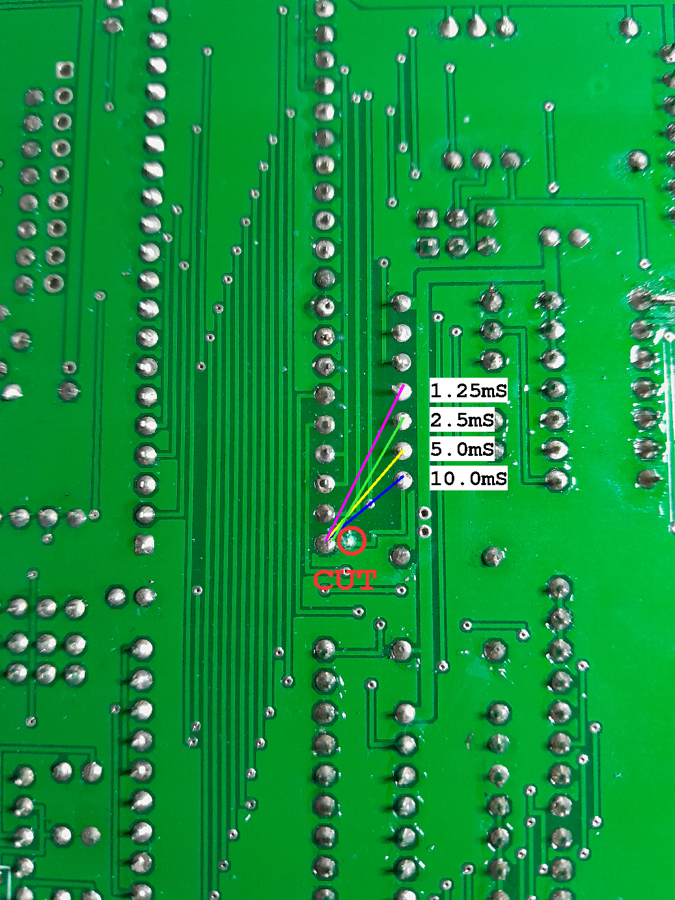

The kernel code and clib.l have been extended with the msleep() function.
It allows a process to do a sub-second sleep.

With default kernel and CPU09MON board the minimum sleep time will be
10.0 mS. Be aware that with msleep(1) the effective sleep time can be
anywhere between 0.0 and 10.0 mS as when the call is made it is unknown 
where the timer is within its current 10mS cycle.

In params.h a new variable has been added 'KBOLT'. The value is '10' times
the inverse divider setting which is '1' by default.

If you want a smaller default you can make a mod at the CPU09MON and achieve
10mS, 5mS, 2.5mS or 1.25mS as time slices. To keep the real-time clock in
the kernel in check, after changing 'KBOLT' _AND_ the CPU09MON board
accordingly, you need to totally rebuild your whole kernel!

