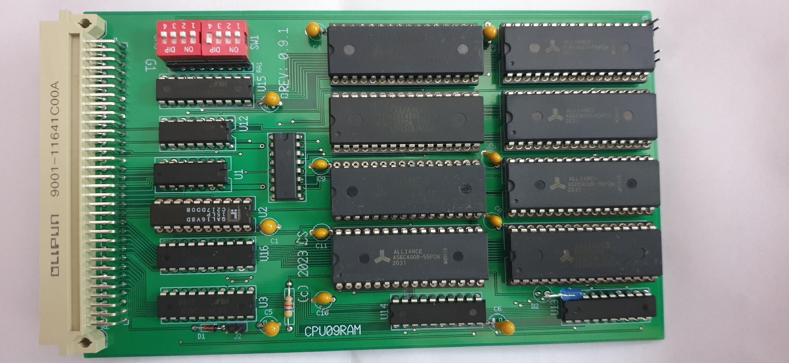

CPU09RAM

<pre>

2023-01-17 under construction, not yet tested
2023-03-14 board is in the mail, waiting

The CPU09RAM is an Eurocard size board with logic and space for up to 8 pieces 
of AS6C4008-55PCN on it, giving a total of 4194304 bytes of volatile storage.

The board provides:
    * up to 4 MB of RAM storage as RAM DISK
    * will be located at FEC00...FEFFF in the address range
    * provides RAM access in 512 Byte pages
    * has address latches to select any of the max 8192 available pages
    * has dipswitches that can be read out to inform the driver
    * no DMA, but the HD63X09 has a block move instruction which is very efficient
    * transfer speed over 125 KByte/sec at OS level
    * options, with switches, 1 or 2 disk images. 
    * ttyget call returns switch settings and total available memory

I created a simple UniFLEX block/char driver for it. The initialization code is 
capable of detecting the size of the RAM devices present, provided that the devices
are placed from the first to the last in adjacent order.

The first device is to be U4 and the last device U11. 1 16V8 GAL serve as 
address decoding and bus signal buffering.

The 2 x 4 position dipswitches can be used to signal the driver and initialization
code to act on it. i.e. Skip size check on power-on reset or skip re-building
the filesystems. Some of the switch signals are also available as jumpers on the 
front edge of thwe board.

As the memory is volatile, the contents are lost on power off. But the RAM disk
can be very helpful when you run from an SD-card. Copy your work over to the RAM disk,
run edit and assembly on the RAM disk contents and save results back to SD-card 
when done. This will prevent the SD-card to wear-out fast.

The design process is interesting to mention. It started as a pop-up board for
a CPU09GPP. That board could hold 4 AS6C4008-55PCN devices. I wrote some code for 
the GPP part and could use flpdrvr.t at the kernel side. It worked well.
Next was moving the pop-up board to a CPU09FLX board.

Immediately I regretted that I had not put all address lines A0...A9 on CPU09FLX, 
so I added the missing lines with wires. Now I had to write a new block driver for it, 
but that turned out not to be complicated. It is fast too.

When I looked to the combo of CPU09FLX and 09RAMDSIK I realized that a single
board was possible and also the better solution. which I now did. 

As for options I can imagine: 
    * one disk to the full  available size. (512KB min and 4 MB max)
    * one 1MB disk for mounting on /tmp and the remainder for general use
    * don't touch contents at /reset (by jumper or by switch)
    * make disk read-only. (by jumper or by switch)  

Be aware that every option is honored by the driver. There is no way of _hardware_
perform a read-only protection. 

At present the dip-switches have the following assigments:
    SW2-4,  ON = (UniFLEX: don't rebuild fs, jumper J3)
    SW2-3,  ON = (UniFLEX write-protect, jumper J4)
    SW2-2,
    SW2-1,
    SW1-4, OFF = (UniFLEX: if possible make 2 disks instead of 1)
    SW1-3,
    SW1-2,
    SW1-1, OFF = Battery Low signal test (Uniflex driver not check it)

[2024-04-23] The first board version (0.9.1) had still an error, the clocks to the address
latches were in reverse order (lowbyte-highbyte).
I corrected that in 0.9.5. The 0.9.1. boards can be fixed easily by 2 trace cuts and 2 small wires,
see attached photo.(20240423_072023.jpg)

Board version 0.9.5 has this fixed.

</pre>
