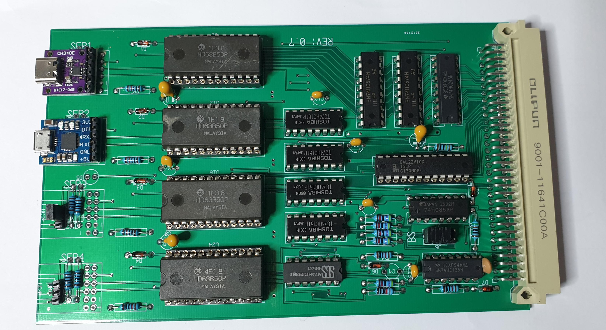

2022-08-14

)

For some time I have been thinking on a variant of the CPU09SR4 for USB.
For the CPU09SR4 to use, mostly you need an USB<->RS232 convertor.

The CPU09US4 solves that problem. Instead of a RS232 interface the
board has place for those tiny USB<->TTL modules. I found these to
exist for USB-C and also for micro-USB. Their sizes are almost the same.

The board can accomodate both versions, but one at a time.

As the pinout for USB-C modules and micro-USB modules differ a bit 
I made pinouts for both. 

The boards can be put on with double-sided adhesive tape and are
definitively fixed with the connection pins.

A total of 4 ports are present, like also on the CPU09SR4.

As for baudrates: you need to set the baudrates for UniFLEX and
USB (terminal emulator) the same.

2022-11-23:

The board has been populated and tested. It works as intended and as such
I will post the design files here.

