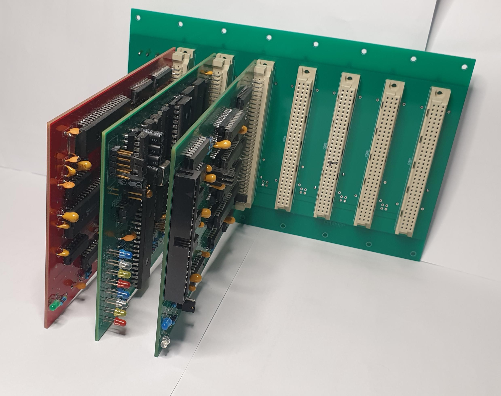

# UniFLEX
an UniFLEX[r]  compatible hardware/software project on Eurocards

Some of us know it, your first love remains forever. In the early 80's I came involved with 6809 UniFLEX from T.S.C. The
SWTPC hardware proved not to be suitable for 24-7, mainly due to the Molex connectors. I got to design an Eurocard based system (CS System) that was influenced for a part by the SWTPC design but had some additions as a DMA SASI interface card, kernel bug fixes, extra kernel drivers and kernel extensions. (i.e. named pipes)

The resulting system has run UniFLEX for many years without failure, that is, the (CS) hardware never failed but the 5 1/4 Winchester disks did, they barely reached one year with 24-7 operation.
In that time the SASI interface was used but now we have/had IDE/PATA and SATA.

Some months ago it started itching and I started to re-design the CPU board as the first one. The original one had a small DATRAM that would allow to re-map memory for processes in 4K blocks, but the DATRAM could only hold one process map. Context switching was
expensive. My new design has a DATBOX in the form of dual ported RAM that will store the maps for 64 processes all at once. Context switching is very cheap, disable/enable a latch now. Furthermore the CPU board has full crash protection. No user process is able to bring down the OS.

The first iteration learned that some things had to change, most particulary the hardware that detects whether the CPU was running as 6809 or 6309. But the intial tests showed that the princicple works. With a HD63C09 it runs smoothly at 4 MHz bus E-clock!

I choose to use no SMT components but DIP20, DIP40, DIP14, DIP16 etc. In the (unlikely) event that someone likes it and want to 
build and experiment with the hard- and software, I feel it is better not to challenge soldering skills too much.
(OK, only very very few ones, which you normally would not need to have ;-( )

UniFLEX features include: 

* fully separated kernel/process space (depending on hardware, but 100% on CPU09XXX)
* full multi-tasking
* full multi-process 
* hiearchical filesystem
* virtual memory in 4K pages (process close to 64K)
* swapping 
* interrupt driven IO
* io DMA
* pipes
* signals
* extensive set of systemcalls via SWI3
* user process traps (illegal memory, interrupt blocking, illegal instruction) HW dependent 

I have found that a lot a assembly code parts almost literally match the Unix V7 C-code for the same function.

Source for kernel and drivers for serial port, parallel port, floppy, WD1002 and IDE, and a lot of more  available.

2024-01-01:

* added TCP/IP networking to the system and the kernel. Now: socket(), connect(), bind(), listen(), accept(),
    read(), write(), close(), recfrom() and sendto() are all implemented at the socket level as the Unix
    versions. Calls can be done in assembly as well from C. A socklib with the interface for the Mc Cosh compiler
    is available. 

TSC wrote their code modular and very structured. One code set is the basic kernel, this code is completely hardware independent.
Another part (in mach_m1) is machine dependent. I adapted that code specifically for the CPU09XXX system. They also made
some runtime settings configurable with the 'tune' utility. The original code had also a 'install' function, that was meant
to defeat copying of UniFLEX. I threw that out in my adaption as it has no longer any merit.

A friend gave me his CS System that he ran professionally up to 1995! It still works, even the SASI Hard disk and it helps me now to recover the missing pieces in knowledge and it is fun to use it again.

I will post all design files and schematics for the boards in the near future when I have completed the tests. 

In the various archives there is still a lot of software for UniFLEX available. A 2MHz system can deliver a nice performance and digging into the corners of software and hardware has learned me so much about OS and hardware solutions.
I am very curious how the 4MHz HD63C09 in native mode would do. :-)

UniFLEX comes with the source code for the kernel (TSC) drivers (CS) and a LOT of support software including:

* TSC Macro Assembler
* TSC Sourcecode Line Editor
* TSC Basic, an extensive and powerful Basic interpreter
* McCosh C, a good C compiler with assembler and linker, the C syntax is compatible with the earlier Unix releases
* TSC Pascal, a Compiler that compiles Pascal into machine code.
* TSC sources for quite a number of their programs
* TSC relocating assembler and linker
* TSC Cobol compiler
* TSC F77 compiler
* TSC sort merge
* TSC text processor
* TSC Use, a sourcecode Screen Editor
* a port of the FLEX debugger to UniFLEX
* Dynacalc, spreadsheet
* Dynamite, disassembler
* Sculptor 4GL
* many more programs,
* Introl C-compiler
* LuciData Pascal
* Database programs
* MSDOS disks read/write utility
* Flex4UniFLEX, accessing FLEX disks under UniFLEX
* various Unix V4 programs ported 

[**] during fall 2023 and spring 2024 TCP/IP networking was added to the system. The Berkeley socket calls were added to the kernel and with new hardware up to 8 sockets are supported.

With my system in the 80s and 90's we had ported OS9 level1 to UniFLEX :-) It would run as a task. Also Motorola MDOS from the Exorciser was ported and would run under UniFLEX.

We ported the FLEX 6809 debugger to UniFLEX and gave it some extra features like a system-call trap. After invocation it would move itself to the top of the 64K space and leaves about 50K of user program. I tried it recently and it was pleasure working with it.
A number of Unix utilities were ported too (with adaptations for i.e permissions) at, atrun, basename, cat, cmp, cron, crypt, ls, pstat, cu, login, su, find, grep, uniq, units, and a lot more ran very well. One guy here made a port of C-Kermit, it is in my archives.

#############################################################################################

Why would I do this all? First it is fun, as it was in those days too. Second, I am getting older (70) and I have a lot of information and knowledge about these systems. I would like to get it immortal. Here on the Internet, for anyone to explore and experience the fun and excitement while doing that. It is also a BIG tribute to the T.S.C. guys who created this incredible nice
software.
#############################################################################################

As more people get involved we could add some simple networking, SD card interface and so on. And yes the boards will have GAL's to minimize discrete logic. That was the reason for my Perlblast project. I will make all design files for the GAL's available too.

I hope I get enough years to complete this project :-)) It would be a nice learning tool for Computer Sience Education. 
The boards are robust against careless handling which makes it very suitable for handling by students. The whole system, 
as everything and anything is open, can be thouroughly examined, modified and extended. It contains many aspects of modern 
computing: virtual memory, DMA, IO, process protection, Interrupts. It worked for me and others very well in that sense.

!!! For those who can't program their own GAL's and/or EPROM's: I am able and willing to help here,but only for this project. 
Drop me an email and we will see how to arrange things.

Same when problems arise, drop me an email and I will try to resolve the issue together with you.

One last word of advise: If you plan to build this project, invest in a good soldering iron, if you have it not already!!
And maybe also very valuable, invest in a TL866II progammer. It is not expensive and does a great job in programming EEROM's and
GAL's.

2021-11-03: I posted a photo of a minimal UniFLEX hardware system. It has
CPU09MM3 (CPU and memory management), CPU09MON (UniBUG ROM, timer, system RAM and 
console port) and CPU09ID6 (DMA capable IDE interface)

UniFLEX(r) was a registered trademark of Technical Systems Consultants.
Note: whenever you can't read the source/(text) files on this archive, try hitting 'Raw' at the top right of the browser window.
