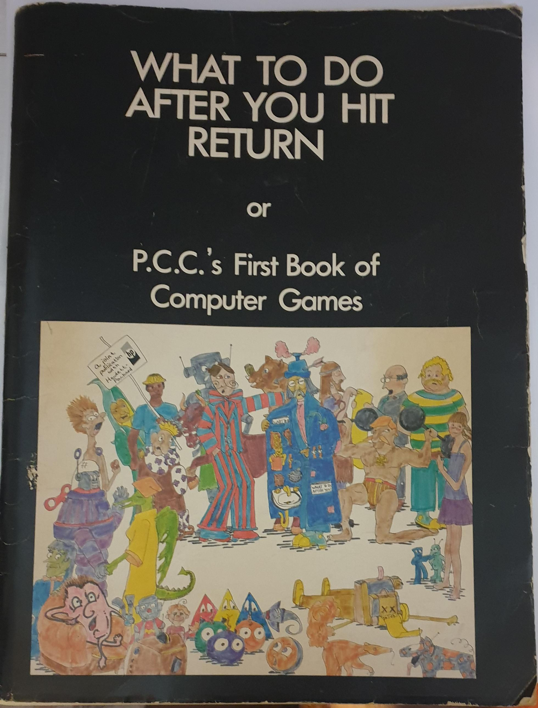

WHAT TO DO AFTER YOU HIT RETURN.  Part No. HP36000-91005  1975

A book full of sketches and software in 'Basic'. With explanations and listings. It was so much fun in those years.
Written by  People Computer Company, P.O. Box 310, Menlo Park, Ca 94025    (415) 323-6117

Number guessing games, Word games, Hide & Seek games, Pattern Games, Board games, Caves, Simulations, Star Trader, etc

I bought in the 70's when I joined a computer fair. I believe it was at HP's stand.

